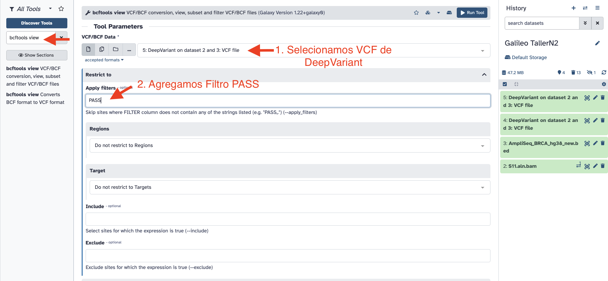
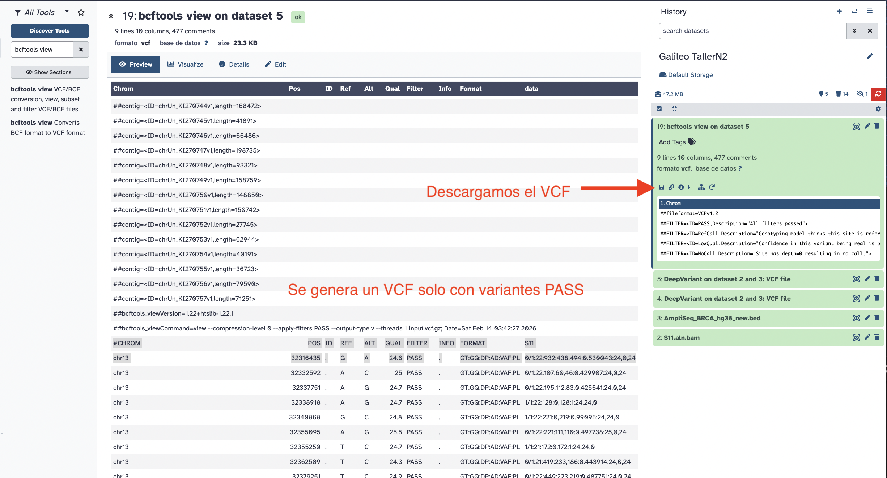

# Taller_N2_Galileo

# Práctico — Llamado y anotación de variantes

## Objetivos

1. Realizar el llamado de variantes en datos genómicos utilizando **DeepVariant** en Galaxy.  
2. Comprender qué es un llamado de variantes y cómo interpretar archivos VCF.  
3. Generar un archivo de variantes y anotar su contenido con bases de datos clínicas (Cancer Genome Interpreter, CGI).  
4. Identificar variantes patogénicas, VUS y benignas en un contexto de cáncer de mama.

---
### ¿Qué es el llamado de variantes?

El llamado de variantes es el proceso mediante el cual se identifican diferencias en la secuencia de ADN de una muestra en comparación con un genoma de referencia.

Los tipos principales de variantes incluyen:
- **SNVs (Single Nucleotide Variants):** cambios de una sola base  
- **Indels:** inserciones o deleciones de bases  
El resultado del proceso es un archivo **VCF (Variant Call Format)** que contiene todas las variantes detectadas.
---

## Parte 1: Llamado de variantes con DeepVariant

### DeepVariant

**DeepVariant** es una herramienta de llamado de variantes basada en aprendizaje profundo.  
Utiliza modelos de redes neuronales para detectar variantes con alta precisión a partir de archivos BAM alineados.

El archivo generado es un VCF que posteriormente puede ser anotado e interpretado.

### 1. Subida de datos a Galaxy

1. Inicia sesión en Galaxy. [Galaxy](https://usegalaxy.org/). 
2. Selecciona **Upload Data** en el panel izquierdo.
3. Carga tus archivos:
     - Un archivo BAM alineado. [Descargar archivo](../CLASE1/data/S11.aln.bam)
     - Un archivo BED con los sitios específicos de BRCA1/2. [Descargar archivo](../CLASE1/data/AmpliSeq_BRCA_hg38_new.bed)

### 2. Llamado de variantes con DeepVariant

1. Busca **DeepVariant** en Galaxy.
   
2. Cargar en galaxy los archivos de entrada (BAM y BED)
   
   
3. Configura los parámetros y ejecuta DeepVariant.
   
   
4. Observa el VCF generado. Cada linea corresponde a una variante
   
5. Filtramos el VCF con bcftools view. Selecionamos solo variantes PASS
   
   
7. Descarga o guarda el archivo VCF generado. 
   

9. Interpretación de Resultados.Los campos clave en un VCF incluyen:
- **CHROM**: Cromosoma de la variante.
- **POS**: Posición de la variante.
- **REF**: Base de referencia.
- **ALT**: Base alternativa.
- **QUAL**: Calidad de la llamada.
- **INFO**: Información adicional (por ejemplo, profundidad de cobertura y frecuencia alélica).

Ejemplo intepretacion de una variante del VCF, descatada de la imagen anterior:

| Campo | Valor | Significado |
|------|------|-------------|
CHROM | chr13 | Cromosoma donde ocurre la variante |
POS | 32316435 | Posición genómica (hg38) |
REF | G | Base de referencia |
ALT | A | Base variante |
QUAL | 24.6 | Calidad de la llamada |
FILTER | PASS | Variante confiable |
GT | 0/1 | Genotipo heterocigota |
DP | 932 | Profundidad de lectura total |
AD | 438,494 | Lecturas ref vs variante |
VAF | 0.53 | 53% de lecturas con la variante |
GQ | 22 | Calidad del genotipo |

(TABLA 1: DESCRIPCION DE VARIANTE)
Variante heterocigota con alta cobertura y frecuencia alélica ~50%, lo que indica una llamada confiable para análisis clínico.
**Ahora debemos averiguar si esta variante es patogénica, benigna o VUS (significado incierto)**

---
## Parte 2: Anotación de Variantes con Cancer Genome Interpreter (CGI)

### **¿Qué es Cancer Genome Interpreter (CGI)?**  
CGI es una herramienta bioinformática que ayuda a interpretar variantes somáticas y germinales relacionadas con el cáncer. Proporciona información sobre el impacto funcional y clínico de las variantes, y las conecta con biomarcadores conocidos y terapias dirigidas.

### **Paso a Paso: Anotación en CGI**  

1. **Acceder a CGI**  
   - Dirígete a [https://www.cancergenomeinterpreter.org](https://www.cancergenomeinterpreter.org).  
   - Crea una cuenta o inicia sesión.  

2. **Subir el archivo VCF**    
   - Haz clic en **"Add file +"** y selecciona tu archivo **VCF**.  
   - Configura las opciones de anotación que se observan en la imagen y haz clic en **"Run"**.
     
   - Se iniciará la anotación de la variantes presentes en el archivo VCF
     

3. **Revisar y Exportar Resultados**  
   - Revisa el informe generado: impacto funcional, relevancia clínica y terapias asociadas.  
   - Descarga el los resulttados y cargalos en **Excel** para documentar.
     
     

---

## Parte 3: Anotación de Variantes Patogénicas con OncoKB

### **¿Qué es OncoKB?**  
**OncoKB** es una base de datos de conocimiento de oncología de precisión que clasifica variantes genéticas en función de su relevancia clínica, desde biomarcadores predictivos hasta variantes sin impacto conocido.

### **Paso a Paso: Identificación de Variantes en OncoKB**

1. **Acceder a OncoKB**  
   - Ingresa a [https://www.oncokb.org](https://www.oncokb.org). 

2. **Buscar Variantes Anotadas**  
   - Utiliza las variantes identificadas previamente en **CGI** 
   - Ingresa cada variante en la barra de búsqueda de OncoKB.
     

3. **Revisar la Clasificación Clínica**  
   - OncoKB clasifica las variantes en diferentes niveles:  
     - **Terapéuticamente accionables** (niveles 1-4).  
     - **De relevancia diagnóstica o pronóstica**.  
     - **Sin impacto clínico conocido**.
       
       

4. **Documentar los Resultados**  
   - Guarda capturas de pantalla o exporta los resultados relevantes.  

---

# 🧬 Tarea 3 — Llamado y anotación de variantes

## Objetivo

En esta tarea el estudiante ejecutará un flujo básico de análisis NGS en Galaxy, replicando el taller realizado en clase.

El estudiante deberá:

- Realizar el llamado de variantes utilizando **DeepVariant**  
- Generar un archivo **VCF**  
- Anotar variantes con bases de datos clínicas y poblacionales  
- Identificar y describir:

  - 1 variante **patogénica**  
  - 1 variante **VUS**  
  - 1 variante **benigna**  

---

## Contexto biológico

Se analizará un **BAM de cáncer de mama** que contiene al menos una variante patogénica conocida en genes asociados a predisposición tumoral.

El objetivo es simular un escenario de interpretación clínica real, donde se debe identificar y clasificar variantes genómicas a partir de datos de secuenciación.

---

## Flujo de trabajo

1. Ejecutar **DeepVariant** en Galaxy con el BAM proporcionado.
2. Obtener el archivo **VCF**.
3. Anotar el VCF utilizando herramientas de anotación en Galaxy (VEP u otra).
4. Seleccionar tres variantes:
   - 1 patogénica  
   - 1 VUS  
   - 1 benigna  

---

## Información a reportar por variante

Para cada variante seleccionada completar la siguiente tabla:

| Campo | Descripción |
|------|-------------|
Gen | Gen afectado |
Tipo de variante | SNV, indel, etc. |
Frecuencia gnomAD | Frecuencia poblacional |
ClinVar | Clasificación clínica |
CADD score | Score de deleteriedad |
OncoKB | Evidencia clínica/terapéutica |

---

## Clasificación final

Cada variante deberá clasificarse como:

- Benigna  
- VUS  
- Patogénica  

La clasificación debe ser **justificada** con evidencia de bases de datos y predictores.

---

## Discusión

Responder y discutir brevemente:

- Número de lecturas que soportan la variante (**DP en el VCF**)  
- Frecuencia alélica de la variante  
- ¿Por qué la variante VUS se clasifica como VUS?  
- ¿Por qué la variante benigna se considera benigna?  
- ¿La variante patogénica tiene asociación farmacológica en OncoKB?  
- ¿Qué relevancia clínica podría tener en cáncer de mama?

---
